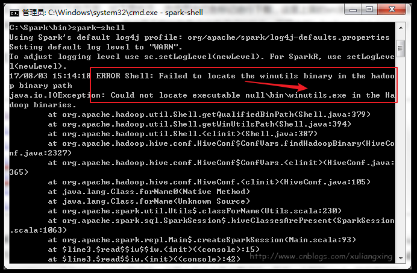
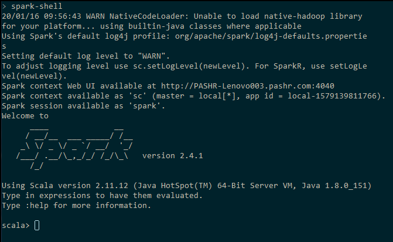
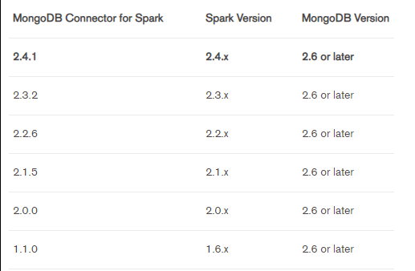
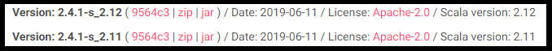
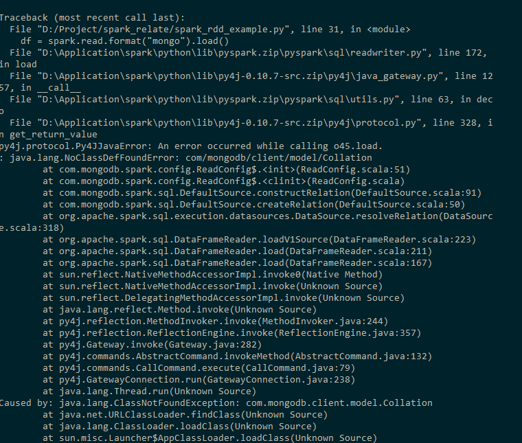

# Spark-example
#### 版本的选择

当你决定部署Spark时，有些事情需要明确

- Spark依赖于Hadoop
- Spark是基于Scala语言开发的

因此要想部署Spark, 除了Spark本身，还需安装Hadoop, Scala。Spark的各个版本需要跟相应的Scala版本对应，而一般推荐初次接触的开发人员使用已经编译好的Spark，预编译的Spark也指定了Hadoop的版本。这时，一个重要的问题由此产生，那么多历史版本，如何确定。

最终选择的版本 

  版本选择| -
  -|-    
  Spark|2.4.1|
  Hadoop|2.7.1|
  Scala|2.11.12|

##### 注：如果使用pyspark,则不需要安装Scala

为什么这么选，请看下面的血泪史

##### 安装

需要安装JDK1.8以上版本，具体安装过程可参考之前的文档

##### Spark的安装

[Spark下载地址](https://archive.apache.org/dist/spark/)

选取对应的版本，下载tgz压缩文件，解压至合适的路径下，并将文件夹重新命名为spark，并且需要注意的是，在Spark的文件目录路径名中，不要出现空格，类似于“Program Files”这样的文件夹名是不被允许的。将Spark的bin目录添加到系统变量PATH中。

例如我这里的Spark的bin目录路径为D:\Application\spark\bin，那么就把这个路径名添加到系统变量的PATH中即可。

##### Scala的安装

[Scala下载地址](https://www.scala-lang.org/download/all.html)

下载msi安装文件，按照指示，一路next即可，但需要注意的是，与安装Spark类似，文件目录路径名中，不要出现空格，否则系统环境变量失效

安装完成后，在cmd中输入scala, 即可进入Scala交互命令行模式。若出现

    scala不是内部或外部命令，也不是可运行的程序或批处理文件

表示scala的环境变量没有正常设置，需要进行手动设置，将Scala的安装路径添加到系统变量PATH中。

##### Hadoop的安装

[hadoop下载地址](https://archive.apache.org/dist/hadoop/common/)

选取对应版本，下载tgz压缩文件，解压至合适路径下，并将文件名重新命名为hadoop, 并将Hadoop的bin目录路径添加至环境变量path中。

例如我这里的Hadoop的bin目录路径为D:\Application\hadoop\bin，那么就把这个路径名添加到系统变量的PATH中即可。

遇到的问题：

在解压过程中，可能出现

    无法创建符号链接，可能需要以管理器身份运行winrar

的错误，采用命令行解压

start winrar x -y hadoop-2.7.1.tar.gz

##### Spark运行

在上述安装完成后，在cmd中输入spark-shell， 即可开启Spark的交互式命令行模式。

遇到的错误

在启动过程中，报如下错误：

这个时候，主要是因为Hadoop的bin目录下没有winutils.exe文件的原因造成的。

解决办法：

1. 下载[winutils.exe](https://github.com/cdarlint/winutils)文件
   注意选择对应的版本号，看这里，可以明白为什么hadoop选择2.7.1版本了吧
2. 下载好winutils.exe后，将这个文件放入到Hadoop的bin目录下即可

最终，spark-shell运行结果如下：

#### Mongodb与Spark

基于mongodb与spark进行数据

mongodb官方给出了与spark进行交互的MongoDB Connector for Spark, 并给出了相关的文档及版本信息，具体见MongoDB Connector for Spark

图中给出了目前MongoDB Connector for Spark的版本信息，这下知道Spark为啥选2.4.1了吧（那为啥2.4.2不行呢？接着往下看）

下面的链接提供了mongo-spark-connector已经编译好的jar包，大家只要按照自己安装的版本信息进行挑选就好了，版本信息样例如下

https://spark-packages.org/package/mongodb/mongo-spark

Version: 2.2.7-s_2.11，其中2.2.7代表Spark版本，2.11代表Scala版本

在下面链接找寻文件时，发现Spark2.4.x的版本只有

这下终于明白2.4.1版本的由来了吧，而Scala版本也确定了就是2.11.x， 那这个x是多少呢？

记得上面spark运行成功的图吗，里面有一句话，using Scala Version 2.11.12, 好了，这个x是12

至此，所有的版本都已经确定，版本选择的逻辑其实是这样的，由于需要winutils.exe文件，因此限制了hadoop的版本(2.6.0, 2.6.3,2.6.4,2.7.1,2.8.0,2.8.1,2.8.3,3.0.0)，而为了使用mongo-spark，最新只能选择2.4.1版本的spark，而2.4.1的spark只提供了基于hadoop2.6与hadoop2.7的版本，最终确定了hadoop2.7.1的版本，由此，scala的2.11.12也终于确定。这是一个反复卸载，反复安装的过程，但生命不息，折腾不止。

MongoDB Connector for Spark提供了示例代码test.py，如下：

需要安装pyspark

    from pyspark.sql import SparkSession
    
    # Create Spark Session
    if __name__ == '__main__':
        spark = SparkSession \
            .builder \
            .appName("myApp") \
            .config("spark.mongodb.input.uri", "mongodb://192.168.1.59:27017/test_data.spark_input") \
            .config("spark.mongodb.output.uri", "mongodb://192.168.1.59:27017/test_data.spark_output") \
            .config("spark.jars.packages", "org.mongodb.spark:mongo-spark-connector_2.11:2.4.1")\
            .getOrCreate()
    
        # Read from MongoDB
        df = spark.read.format("mongo").load()
        df.printSchema()
    
        # Filter and Write
        df.filter(df['qty'] >= 10).write.format("mongo").mode("append").save()

打开cmd, 输入spark-submit test.py，查看运行结果

遇到的错误

解决方法：

参考如下链接，应该是jar包缺失导致的， 按照问题中提供的链接，下载jar包，将其复制到spark/jars文件夹下

[PySpark MongoDB :: java.lang.NoClassDefFoundError: com/mongodb/client/model/Collation](https://stackoverflow.com/questions/52385123/pyspark-mongodb-java-lang-noclassdeffounderror-com-mongodb-client-model-coll?r=SearchResults)

最后，补完缺失的jar包，终于运行成功

