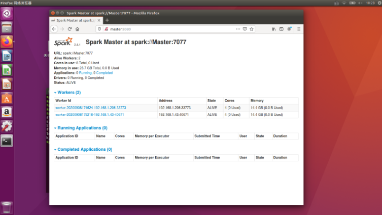

#### 准备工作

##### 1.机器准备
`192.168.1.43 Master`     
`192.168.1.206 Slave1`

相关环境：            
Linux系统：Ubuntu16.04       
python: Miniconda3,python版本3.6.3             
java: jdk_1.8.0_151           

##### 2.linux的安装与JDK,python的安装
参考之前的文档，每台机器的配置保持一致

#### 配置步骤

##### 1.每台机子创建新的用户账号，并赋予其root权限创建新账号，spark安装在该用户下

**本例中新创建的用户名为spark**    
`sudo adduser spark`    
输入密码后，一路回车即可

**赋予其root权限**      
`sudo vim /etc/sudoers`   
修改文件如下：      
`User privilege specification`    
`root ALL=(ALL) ALL`   
`spark ALL=(ALL) ALL`    

**修改主机名字（每台）**   
`sudo vim /etc/hostname`       
将原始名称分别改为 Master（192.168.1.43），Slave1（192.168.1.206）

**在每台机器的/etc/hosts中修改各个节点的IP与主机名的对应**     
`sudo vim /etc/hosts`     
在文件中将127.0.0.1 相关注释掉，添加如下内容           
`192.168.1.43 Master`           
`192.168.1.206 Slave1`               

重启电脑后，主机名修改生效         

#### 2.集群间ssh免密登录
注意事项：集群间免密登录使用统一配置的spark账户进行以下操作，不要使用root账户，这是因为spark安装在spark账户下要配置spark集群，需要进行集群机器间的免密登录

原理：在Master上生成一个密钥对，包括一个公钥和一个私钥，而后将公钥复制到所有的Slave上。当Master通过SSH连接Salve时，Salve就会生成一个随机数并用Master的公钥对随机数进行加密，并发送给Master。Master收到加密数之后再用私钥解密，并将解密数回传给Slave，Slave确认解密数无误之后就允许Master进行连接了。这就是一个公钥认证过程，其间不需要用户手工输入密码，保证了集群中的数据传输。
   
##### 每台机子均进行如下操作:

**安装ssh**    
`sudo apt-get install ssh`

**生成密钥**      
`ssh-keygen -t rsa -P ""`   
均选择默认回车，生成的密钥文件位于 /home/spark/.ssh/，此时该文件夹内存在两个文件，分别为：    
私钥：id_rsa        
公钥：id_rsa.pub          

**将公钥复制为authorized_keys文件，实现自身免密登录**     
`cp id_rsa.pub authorized_keys`         

##### 节点间ssh免密登录配置           

**Master免密登录Slave1**       

将Master的公钥拷贝到Slave1的authorized_keys文件中            
`ssh-copy-id -i Slave1`            
输入Slave1中spark账号密码后，免密登录配置成功，输入              
`ssh Slave1`           
可直接登录至spark@Slave1,表示配置成功   

**Slave1免密登录Master**             
将Slave1的公钥拷贝到Master的authorized_keys文件中          
`ssh-copy-id -i Master`                
输入Master中spark账号密码后，免密登录配置成功，输入            
`ssh Master`                  
可直接登录至spark@Master,表示配置成功             

##### 出现的问题
输入ssh-copy-id xxx后，需要输入spark@xxx密码,在密码正确的情况下，可能会出现如下情况：          
`spark@xxx's password:Permission denied, please try again.`        
`spark@xxx's password:Permission denied, please try again.`          
`spark@xxx's password:spark@xxx: Permission denied (publickey,password).`          

此时需要修改服务器的配置文件                      
`sudo vim /etc/ssh/ ssd_config`             
找到如下信息并改为yes                      
`PermitRootLogin yes`            

##### 3.Spark配置安装
在Master节点下，切换到spark账号下，进入spark安装文件所在文件夹，解压         
`tar -zxvf spark-2.4.1-bin-hadoop2.7.tgz -C /home/spark`      
将文件夹重命名为spark                    
`mv spark-2.4.1-bin-hadoop2.7/ spark`        
进入 spark conf 配置目录下：           
`cd /home/spark/spark/conf/`     
`mv spark-env.sh.template spark-env.sh`           
`vim spark-env.sh`  
在该文件下添加：       
`export JAVA_HOME=/usr/local/jdk1.8.0_151`     
`export SPARK_MASTER_IP=Master`              
`export SPARK_MASTER_PORT=7077`       
`export PYSPARK_PYTHON=/usr/miniconda3/bin/python`         
`export PYSPARK_DRIVER_PYTHON=/usr/miniconda3/bin/python`        
SPARK_MASTER_IP 指明主节点。                
由于linux，spark本身自带了python，最后两行指明在spark处理过程中，调用的python来自哪里，否则会出现类似如下的警告              
`Exception: Python in worker has different version 3.5 than that in driver 2.7, PySpark cannot run with different minor versions`         

添加子节点所在的位置（Worker节点）        
`mv slaves.template slaves`       
`vim slaves`        
在slaves文件中输入如下信息         
`Slave1`       

##### 节点复制

配置好 spark 后，将整个 spark 目录拷贝到其他节点上（注意节点的路径必须和master一样，否则master启动集群回去从节点中对应目录中去启动 work，不一致会报 No such file or directory）。           
`scp -r /home/spark/spark spark@Slave1:/home/spark`

启动节点               
`/home/spark/spark/sbin/start-all.sh`        
此时进入master:8080，可以看到节点的信息,具体如下             



### 配置时的血泪！！！  
各个节点相应账号下的python环境，Java环境保持一致，包括版本，安装路径等        
集群搭建好后，涉及到第三方库的，例如mongo-spark-connector等的使用，参考单机版的安装
    
##### linux与windows差异      
在linux(Ubuntu16.04下)，pyspark版本号与spark版本号应当保持一致，本例中，spark版本为2.4.1，则pyspark版本为2.4.1，应该是涉及到py4j底层的东西，pyspark版本不同，py4j的版本也不同（但在windows下则不存在这个问题） 

在linux(Ubuntu16.04下)，使用spark-submit提交任务时，要使用--packages  org.mongodb.spark:mongo-spark-connector_2.11:2.4.1来显式的指明所引用的第三方包，在代码中添加config配置是没有用的，但在windows中，在代码中指明即可，不需要显式指明 
   
#### Spark与MongoDB结合使用
##### 问题1
开始使用spark-submit提交任务时，总是在报错
`
Failed to find data source: com.mongodb.spark.sql.DefaultSource,Please find packages at http....
`
stackoverflow,google论坛给出的答案均是没有spark没有找到mongo-connector的jar包，给出的解决方式包括设置路径，补充缺失的jar包，在代码中声明等，尝试了均没有用（折腾了快一天），最终追溯代码，找到py4j，发现该包应该是调用的偏底层的东西，结合一篇文档说pyspark与spark版本一致，最终发现，解决方法是pyspark的版本与spark一致（pyspark安装依赖于py4j,而py4j又在调用底层的东西，不同的pyspark所以来的py4j版本也不一致）。若版本一致的情况下，还出现该问题，则可尝试上述解决方案             

##### 问题2
spark与MongoDB结合使用时，需要使用相关的jar包，包括mongo-spark-connector,mongo-java-driver,mongo-driver,bson,mongo-driver-core
当这些jar包版本过低或者不兼容时，会出现`NoSuchMethodError,NoClassDefFoundError`等错误，
经过尝试，最终选择版本为3.10.2，上述jar包的下载地址               
[地址1][4]           
[地址2][5]           


#### 集群模式下，python引入自定义模块及外部文件的处理                    
在集群模式下，在代码中引入外部自定义的函数模块，会出现`no module named xxx`的错误，我们需要显式的指明，使用--py-files来进行指明                      
1. 若引用的外部模块只有一个py文件，则只需要在--py-files xxx.py即可              
2. 若引用的外部模块为多个py文件，则需要将其进行打包              
以预处理程序为例                    
预处理的代码结构如下

```
resume-preprocess:                     
|---data           
      |---company.json            
      |---ITTechwords.py            
      |---vocab.txt.py         
      |---mapping.yml           
      |---....            
|---config
      |---config.yml            
|---preprocess      
      |---__init__.py                 
      |---base.py          
      |---company_parse.py             
      |---data-clean.py         
      |---education.py               
      |---job.py                  
      |---...          
|---resume_spark.py(运行文件) 
```
preprocess是我们自定义的模块，需要将其进行打包                   
打包时，进入resume_preprocess文件夹下，输入如下指令  
`cd resume_preprocess`                
`zip -r ../preprocess.zip .`     
注意千万不在preprocess文件夹下进行打包，具体原因参考[pyspark程序运行报错：no module named XXX（本地pycharm没问题而线上cmd下运行有此问题）][6]             
启动命令如下：                 
`spark-submit --master spark://Master:7077 --executor-memory 3G --total-executor-cores 8 --packages org.mongodb.spark:mongo-spark-connector_2.11:2.4.1 --py-files  preprocess.zip resume_spark.py
`
spark集群在运行时，启用的executor会在对应的work文件夹下寻找所需要的外部数据源，因此，在调用外部数据data时，会出现引用数据源路径错误       
由于preprocess.zip生成时，代码中需要引入的外部数据源data与config也被压缩进了preprocess.zip中，在集群运行时，preprocess.zip被上传至work对应文件夹下，因此我们只需要读取preprocess.zip，将data与conf文件解压出来，在代码中对路径进行判断，进行路径的重新定义，引用即可       

##### 参考文章

[免密登录配置][1]

[spark集群安装][2]

[ssh passwd denied][3]

[1]: https://blog.csdn.net/Anbang713/article/details/82215339
[2]: https://www.jianshu.com/p/18aebb05972d
[3]: https://blog.csdn.net/BakerTheGreat/article/details/104300128
[4]: https://mvnrepository.com/artifact/org.mongodb
[5]: https://repo1.maven.org/maven2/org/mongodb/
[6]: https://blog.csdn.net/sinat_26566137/article/details/88921501
